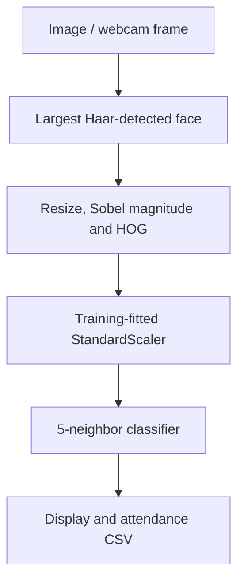

# Face Recognition with HOG and k-Nearest Neighbors

A computer vision learning project that detects the largest face in a frame, extracts a gradient-based descriptor, classifies it with k-nearest neighbors, and demonstrates daily attendance logging.

**Python · OpenCV Haar cascade · HOG features · StandardScaler · kNN**

[Source walkthrough](docs/methodology.md) · [Restore the private dataset and original presentation](archive/README.md) · [Original code](archive/original-code/main.py)

## Processing flow



The attachment contains **244 training images in 16 numbered folders** and a 25-minute presentation recording. Names in the demo are placeholder labels; they do not establish the identities of the people pictured. Face images and attendance examples are kept in the private original archive. Do not distribute them as a public dataset without establishing the appropriate rights and consent.

## Repository guide

| Location | Contents |
|---|---|
| [src/main.py](src/main.py) | Cleaned demonstration entry point |
| [archive/original-code/](archive/original-code) | Unchanged submitted Python source |
| [archive/parts/](archive/parts) | Lossless complete uploaded ZIP |
| [scripts/restore_assets.py](scripts/restore_assets.py) | Restore training images and original video |
| [docs/methodology.md](docs/methodology.md) | Feature pipeline, cleanup changes and limitations |
| [demos/](demos) | Original recording after restoration |

## Run the historical demonstration

```sh
python3 scripts/restore_assets.py
python -m venv .venv
# Activate the environment, then:
python -m pip install -r requirements.txt
python src/main.py
```

This command trains, opens evaluation plots and then starts the local webcam. Close the plots to continue; press `q` in the video window to stop. Run only in a suitable local desktop environment. Dependencies are listed from imports; the original version lockfile was not supplied.

The cleanup fixes portable data paths, unreadable-image handling, feature/label alignment and creation of a new attendance CSV. Historical recognition thresholds remain exploratory. Syntax and original-archive reconstruction were checked, but OpenCV/scikit-image were unavailable, so no classifier evaluation or webcam test was run. No accuracy score is claimed.
